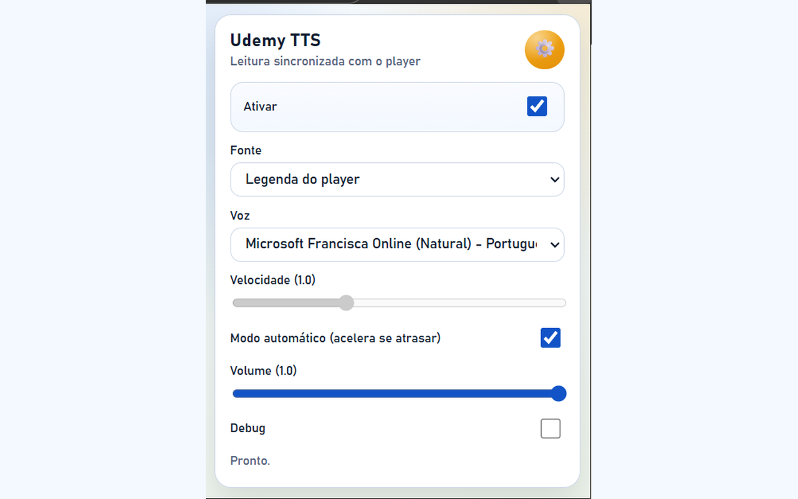
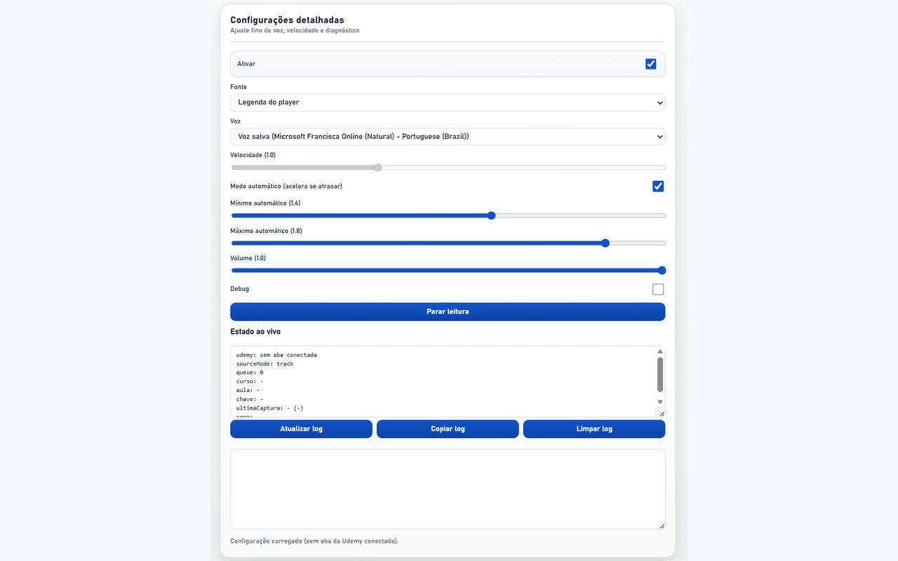

# Udemy Transcript TTS (Free)

Ficar preso na legenda tira foco do conteudo principal da aula.  
Esta extensao usa a voz nativa do navegador para **ler as legendas da Udemy em tempo real**, com sincronizacao e ajuste automatico de velocidade para reduzir atrasos.

## Principais recursos

- Leitura TTS da **legenda do player** (modo padrao).
- Opcao de fonte por **painel de transcricao**.
- Vozes nativas do Edge/Chrome (sem custo adicional por API).
- Modo automatico de velocidade com limites configuraveis.
- Configuracao detalhada (voz, volume, debug e diagnostico).

## Escopo atual

- Modo resumo/salvamento local e integracoes externas: **desativados nesta build**.
- Foco da versao de loja: estabilidade da leitura TTS sincronizada.

## Screenshots

### Popup

### Configuracoes

## Privacidade

- A extensao nao coleta nem envia dados para servidores proprios.
- O processamento acontece localmente no navegador.
- Veja detalhes em [PRIVACY.md](PRIVACY.md).

## Suporte

- Issues: https://github.com/mathiasvinicius/udemy-tts/issues
- Email: vinicius.mathias@gmail.com
- Guia rapido: [SUPPORT.md](SUPPORT.md)

## Desenvolvimento local

1. Edge -> `edge://extensions`
2. Ative `Modo de desenvolvedor`
3. Clique em `Carregar sem compactacao`
4. Selecione a pasta deste repositorio

## Empacotamento para loja

- Arquivo de listing: [edge-listing.md](edge-listing.md)
- Checklist de publicacao: [tasklist.md](tasklist.md)

